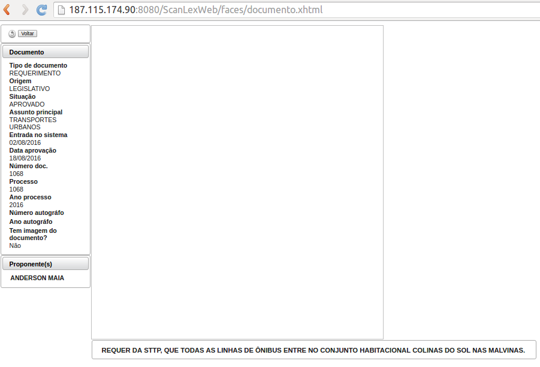

# CG Insights

Com o objetivo de averiguarmos a situação política da Câmara Municipal de Campina Grande e assim exercermos mais diretamente nosso papel de cidadãos, lançamos mão da [Legislação sobre a Transparência Pública](http://www.portaldatransparencia.gov.br/sobre/Legislacao.asp) e coletamos o histórico de ementas publicadas no site da [Câmara Municipal de Campina Grande](https://www.campinagrande.pb.leg.br/) durante os anos de 2009 e 2016, mais especificamente no [Sistema de Busca de Documentos](http://187.115.174.90:8080/ScanLexWeb/).

Nosso objetivo é fortalecer o valioso esforço da população brasileira em conhecer mais e melhor o que e como trabalham os seus representantes no governo do país.

## Base de Dados
A base de dados é composta pela tabela principal **ementas** (primeira do topo) e também por tabelas auxiliares geradas à mão (i.e. *comissoes_tecnicas*, *mesa_diretora*) e tabelas extraídas do Repositório de dados eleitorais no site do [Tribunal Superior Eleitoral (TSE)](http://www.tse.jus.br/eleicoes/estatisticas/repositorio-de-dados-eleitorais). Abaixo mostramos as tabelas e como elas são definidas, a principio não forçamos relações (i.e. chave estrangeira) mas elas podem ser criadas por meio das colunas com ids. 

Os dados foram armazenados em um Banco de dados Postgresql e estão disponíveis para download aqui: [Dump Camara DB (dados até 12-08-2016)](data/dump_camara_db_12-08-16.zip).

### Descrição das tabelas

#### Ementas
As ementas são coletadas de uma página como essa:

A imagem mostra todos os campos disponíveis de uma ementa no Sistema de Busca de Documentos, na maioria dos casos elas não tem imagem (i.e. has_image). Toda ementa é adicionada no sistema (i.e. sys_enter_date) e é diferencida por ids do sistema (i.e. document_number e process_number). Cada uma tem os seguintes campos: uma data de publicação (i.e. published_date), um  tipo específico (i.e. ementa_type), um tema principal (i.e. main_theme), um título (i.e. title), os proponentes (i.e. proponents), uma fonte (i.e. source) que diz de onde vem os proponentes (LEGISLATIVO ou EXECUTIVO), uma situação (i.e. situation) que inicia EM TRAMITAÇÃO até ser APROVADA (i.e. approval_date) ou não. Por fim, o horário da coleta de cada ementa é armazenado no insert_time.

Mais abaixo na seção *Como Funciona?** damos mais detalhes do processo de submissão, discussão e aprovação de ementas, também conhecidas como proposições.

#### Tabelas auxiliares
A tabela **comissoes_tecnicas** lista as comissões técnicas formadas na câmara para lidar com questões específicas. Ela possui também o ano da eleição, o nome do candidato e seu id permitindo o relacionamento com as demais tabelas. Fizemos o mesmo com a tabela **mesa_diretora**, montamos a mão a lista da mesa diretora para facilitar futuras análises.

#### Tabelas do TSE
As tabelas do TSE tem suas próprias descrições disponibilizadas pelo Repositório e também acessíveis aqui: [docs/TSE_Leiame.pdf](docs/TSE_Leiame.pdf) e [docs/TSE_Leiame_Perfil_Eleitor.pdf](docs/TSE_Leiame_Perfil_Eleitor.pdf))

## Exemplos de Insights

Listamos abaixo exemplos de insights encontrados apenas com a tabela *ementas* que dão uma ideia do valor dessa base de dados.

* [Temáticas Parlamentares](insights/tematicas_parlamentares.md)
* [O tempo passa mas os temas se repetem...](insights/temas_no_tempo.md)
* [Meu Vereador? Explique-me por favor...](insights/vereador_expliqueme.md)

## Como funciona?

**Como funcionam as câmaras municipais do Brasil?**

Referenciamos aqui a página da [Câmara Municipal de Manaus](http://www.cmm.am.gov.br/camara-municipal-de-manaus/a-camara/como-funciona/) que graciosamente descreve os *Tipos de Sessões Parlamentares*, a *Composição de uma Sessão Ordinária* e as *Funções do Vereador*. Nesta página as ementas são também chamadas de proposituras.

A cidade de Barcelona - RN também publicou um FAQ bem completo sobre o [Tema Vereador](http://www.barcelona.educ.ufrn.br/vereador.htm).

**E a Câmara Municipal de Campina Grande?**

Montamos então a página [Como funciona a Câmara de Campina Grande?](insights/como_funciona.md) com detalhes importantes sobre a 16ª Legislatura (2012 - 2016). E apesar do foco desse projeto não serem análises financeiras, realizamos uma pequena inserção nesse contexto para responder a seguinte pergunta: [Quanto ganham os vereadores de Campina Grande?](insights/quanto_ganham.md).

## Aviso
Esse repositório e todo o seu conteúdo não tem nenhuma intenção muito menos relação com quaisquer candidato a eleição ou pessoa pública.
