Como Funciona a Câmara Municipal de Campina Grande?
================
19 de Agosto, 2016

Conhecendo a Câmara (Mandato 2013 - 2016)
-----------------------------------------

A nossa câmara é composta atualmente por **23 vereadores** responsáveis principalmente pelo poder legislativo municipal e por instruir e fiscalizar o executivo, ou seja, representado pelo prefeito. Essas atribuições fazem deles peças chaves no concerto municipal e, por isso, nosso voto é de suma importância para a melhoria da qualidade de vida de Campina Grande.

Apesar de escolhermos 23 vereadores, os **13** candidatos com mais votos dentre os demais compõem a lista de **suplentes**, ou substitutos. Eles são escolhidos para tomar posse temporária ou definitivamente em casos de afastamento de algum dos 23. Em Campina Grande, por obra do "acaso", todos os 13 suplentes tomaram posse pelo menos uma vez durante este último mandato...

Pra começarmos bem, vamos conhecê-los todos, pela foto é melhor porque fixamos mais. E lembramos dos seus feitos (e desfeitos) caso apareçam na propaganda, na rua, ou na Câmara quem sabe?

### Vereadores Eleitos

|  | 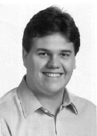 | 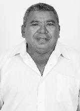                              | 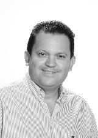                 | 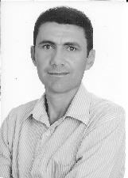 |
|:----------------------------------------------------------------------------------|:-----------------------------------------------------------------------|:---------------------------------------------------------------------------------|:----------------------------------------------------------------------------|:--------------------------------------------------------------------|
| ALEXANDRE DO SINDICATO - PTC                                                      | BRUNO CUNHA LIMA - PSDB                                                | BUCHADA - PTN                                                                    | DR. OLIMPIO - PMDB                                                          | GALEGO DO LEITE - PMN                                               |
| 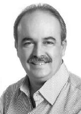                  |          | 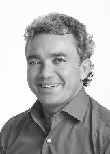                    |                            | 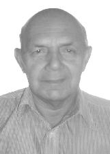         |
| INÁCIO FALCÃO - PSDB                                                              | IVAN BATISTA - PMDB                                                    | JOIA GERMANO - PRP                                                               | LAFITE - PSC                                                                | LULA CABRAL - PRB                                                   |
| 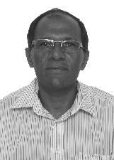           | 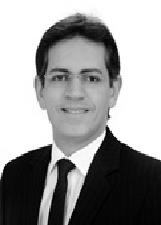       | 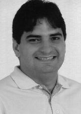                |  | 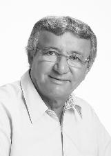       |
| MARINALDO CARDOSO - PRB                                                           | METUSELA AGRA - PMDB                                                   | MURILO GALDINO - PSB                                                             | NAPOLEÃO MARACAJÁ - PC do B                                                 | NELSON GOMES - PRP                                                  |
| 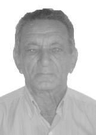             |      | 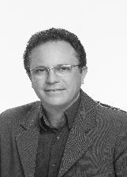 | 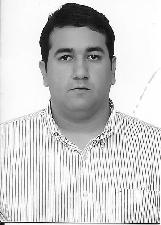             | 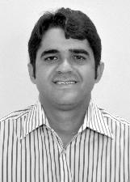     |
| ORLANDINO FARIAS - PSC                                                            | PIMENTEL FILHO - PMDB                                                  | PROF. MIGUEL RODRIGUES - PPS                                                     | RODRIGO RAMOS - PMN                                                         | SAULO NORONHA - DEM                                                 |
| 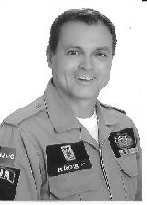                           | 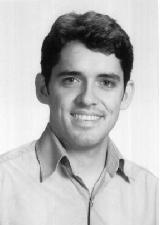                       |                 |                                                                             |                                                                     |
| SGT REGIS - PMN                                                                   | TOVAR - PSDB                                                           | VANINHO ARAGAO - DEM                                                             |                                                                             |                                                                     |

### Vereadores Suplentes

| 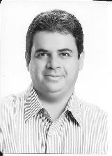 | 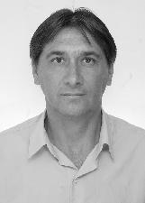 | 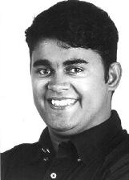               |    | 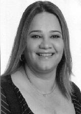  |
|:------------------------------------------------------------------------|:----------------------------------------------------------------|:------------------------------------------------------------------------------|:------------------------------------------------------------------|:-----------------------------------------------------------------------|
| ALCINDOR VILLARIM - PMN                                                 | ALDO CABRAL - PC do B                                           | ANDERSON MAIA - PSB                                                           | ARAGÃO JUNIOR - PSD                                               | IVONETE LUDGERIO - PSB                                                 |
| 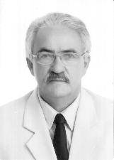             | 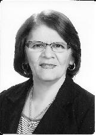 | 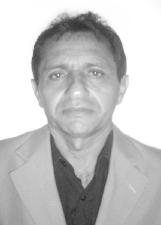 | 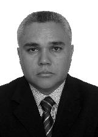 | 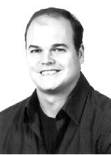 |
| JOAO DANTAS - PSD                                                       | LOURDES COSTA - PMN                                             | MIGUEL DA CONSTRUÇÃO - PRB                                                    | PASTOR JOSIMAR - PRB                                              | RODOLFO RODRIGUES - PR                                                 |
| 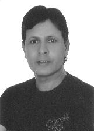     | 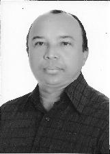 |                           |                                                                   |                                                                        |
| ROSTAND PARAIBA - PRB                                                   | SAULO GERMANO - PMN                                             | TIA MILA - PV                                                                 |                                                                   |                                                                        |

### Mesa Diretora

A mesa diretora tem um importante papel na casa, como toda organização precisa de alguém que lidere, precisa de tesouraria e de secretaria. Na maioria dos casos escolhem-se aqueles com mais experiência na Câmara, como é o caso de *Pimentel Filho* que já vai no seu sétimo mandato consecutivo. A mesa é eleita duas vezes no mandato, logo no início, fica dois anos lá e depois elegem de novo. Abaixo estão as duas mesas diretoras desse mandato.

**Mesa Diretora - Biênio 2013-2014**

| Presidente                                                    | 1º Vice                                                           | 2º Vice                                                          | 1º Secretário                                                      | 2º Secretário                                                   |
|:--------------------------------------------------------------|:------------------------------------------------------------------|:-----------------------------------------------------------------|:-------------------------------------------------------------------|:----------------------------------------------------------------|
|  |  |  |  |  |
| NELSON GOMES                                                  | MURILO GALDINO                                                    | INACIO FALCAO                                                    | PIMENTEL FILHO                                                     | RODRIGO RAMOS                                                   |

**Mesa Diretora - Biênio 2015-2016**

| Presidente                                                         | 1º Vice                                                               | 2º Vice                                                                 | 1º Secretário                                                     | 2º Secretário                                                  |
|:-------------------------------------------------------------------|:----------------------------------------------------------------------|:------------------------------------------------------------------------|:------------------------------------------------------------------|:---------------------------------------------------------------|
|  |  |  |  |  |
| PIMENTEL FILHO                                                     | ORLANDINO FARIAS                                                      | MARINALDO CARDOSO                                                       | MURILO GALDINO                                                    | IVAN BATISTA                                                   |

### Comissões Técnicas

Para se organizar melhor as câmaras definem *comissões técnicas* que se especializam em assuntos específicos. Abaixo listamos as **13 comissões** da nossa câmara. Analisaremos melhor as comissões mais a frente pra saber se eles realmente estão trabalhando! Mas de antemão, já esperamos minimimamente que os vereadores da *Comissão de Agricultura e Pecuária*, por exemplo, devem ter mais propostas relacionadas a projetos rurais do que a Serviços Urbanos, não acha?! E em um segundo moemnto, podemos validar até a relevância dessas ementas.

|   Id| Comissão                                                                                  |
|----:|:------------------------------------------------------------------------------------------|
|    1| Comissão Constituição, Justiça e Redação                                                  |
|    2| Comissão de Agricultura e Pecuária                                                        |
|    3| Comissão de Ciência, Tecnologia, Inovação, Comunicação e Informática                      |
|    4| Comissão de Defesa dos Direitos da Mulher, Idoso, da Criança e do Adolescente             |
|    5| Comissão de Desenvolvimento Econômico, Indústria e Comércio                               |
|    6| Comissão de Direitos Humanos, Defesa do Consumidor, do Contribuinte e do Servidor Público |
|    7| Comissão de Educação, Esporte e Turismo                                                   |
|    8| Comissão de Finanças, Orçamento, Fiscalização Financeira e Controle                       |
|    9| Comissão de Meio Ambiente e Recursos Hídricos Convivência e Sustentabilidade do Semiárido |
|   10| Comissão de Obras, Planejamento, Infraestrutura e Habitação                               |
|   11| Comissão de Saúde e Bem Estar Social                                                      |
|   12| Comissão de Segurança Pública, Defesa Social e Prevenção as Drogas                        |
|   13| Comissão de Transporte e Mobilidade Urbana                                                |

Pra fechar... Por que a câmara tem 23 vereadores? É assim em todo o país?
-------------------------------------------------------------------------

O tamanho da população da cidade define a quantidade de vereadores de sua Câmara. Campina Grande tem **385.213 habitantes** (pelo [Censo de 2010](http://www.ibge.gov.br/home/estatistica/populacao/censo2010/)), sendo assim ela encaixa-se na faixa de 300.000 até 450.000 definida pela Constituição Federal (Artigo 29-A), tendo assim obrigatoriamente **23 vereadores**.

Mas não foi sempre assim! Até 2009 tudo era diferente, as regras eram bem mais simples, definiam quantidades mínimas e máximas de vereadores, por exemplo, ela dizia que municípios como Campina Grande, que tem menos de 1 Milhão de habitantes, podem ter no mínimo 9 e no máximo 21 vereadores! Ai já se viu né?! Campina tinha 16, uma quantidade razoável para o nosso tamanho, mas pelo Brasil a fora tinha cidades bem menores que Campina tendo 21 vereadores! É isso que resulta dar liberdade pra quem ainda não sabe usá-la... É uma pena, mas essa é a nossa condição. Então, em Setembro de 2009 mudaram a lei, ou melhor, emendaram ela (jargão da área), e fizeram a que vigora hoje, que obriga as cidades a terem um número X dependendo do nº de habitantes.

No final da história, Campina ganhou 7 vereadores num passe de mágica! No mandato de 2008 - 2012, tinha 16 e nas eleições de 2012 já votamos em 23! E eu lhe pergunto, o que foi que nós ganhamos com isso? Se ganhamos não notamos!

Por essas e outras ressalto a importância de nosso papel na fiscalização do trabalho dos políticos, tanto pra sabermos o que eles estão fazendo como pra fiscalizar a qualidade do que estão fazendo! Afinal, tudo sai de nosso bolso e dando errado quem é que vai pagar???

**Próximo Post**: [Quanto Ganham nossos Vereadores?](quanto_ganham.md)

------------------------------------------------------------------------

### Mais info?

-   [Regimento Interno da CMCG](https://www.campinagrande.pb.leg.br/wp-content/uploads/2014/03/REGIMENTO-INTERNO-CMCG-ATUALIZADO.pdf)
-   Emenda da Constituição: [EMENDA CONSTITUCIONAL Nº 58, DE 23 DE SETEMBRO DE 2009](http://www.planalto.gov.br/ccivil_03/constituicao/emendas/emc/emc58.htm)
-   Análise do excesso de liberdade da lei anterior publicada pela Câmara Federal: [FIXAÇÃO DO NÚMERO DE VEREADORES PELOS MUNICÍPIOS](http://www2.camara.leg.br/documentos-e-pesquisa/publicacoes/estnottec/areas-da-conle/tema6/2010_10930.pdf)

------------------------------------------------------------------------
