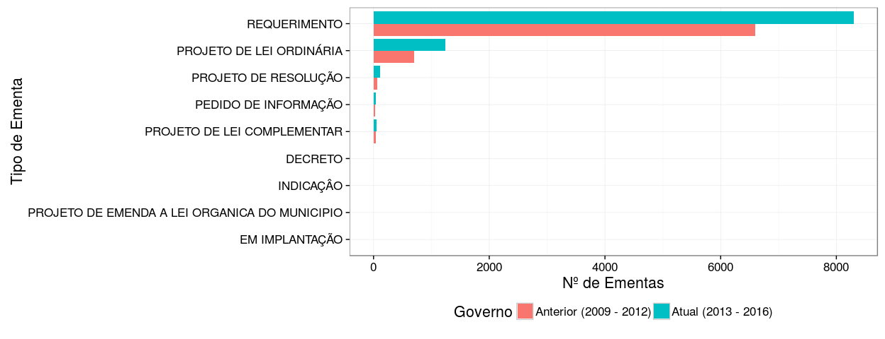

Mermão, me diga o que é MOÇÃO?
================
20 de Agosto, 2016

Criamos esse insight para tentar clarear os tipos de ementa e os temas de cada ementa. A [Lei Orgânica do Município de Campina Grande](http://pmcg.org.br/wp-content/uploads/2014/09/Lei-Organica-do-Municipio.pdf) trata DO PROCESSO LEGISLATIVO na Seção IV com o seguinte artigo definindo os tipos de ementa:

    Art. 51 - O processo legislativo compreende a elaboração de:

    I - emenda à Lei Orgânica;
    II - lei complementar;
    III - lei ordinária;
    IV - decreto legislativo;
    V - resolução.

    Parágrafo único - São ainda objeto de deliberação da Câmara, na forma do Regimento Interno:

    I - a autorização;
    II - a indicação;
    III - o requerimento.

Abaixo mostramos um gráfico de barras que conta a quantidade e ementas aprovadas por **Tipo** de ementa. Vemos que a grande maioria são Requerimentos depois Projetos de Lei Ordinária.

Listamos dois exemplos de ementas para cada Tipo abaixo.

| Tipo da Ementa                                | Título                                                                                                                                                                                                                                  |
|:----------------------------------------------|:----------------------------------------------------------------------------------------------------------------------------------------------------------------------------------------------------------------------------------------|
| DECRETO                                       | DECRETA PONTO FACULTATIVO NAS REPARTIçõES PúBLICAS MUNICIPAIS E Dá OUTRAS PROVIDêNCIAS.                                                                                                                                                 |
| DECRETO                                       | DECRETA PONTO FACULTATIVO NAS REPARTIçõES PúBLICAS MUNICIPAIS E Dá OUTRAS PROVIDêNCIAS.                                                                                                                                                 |
| DECRETO                                       | DECRETA PONTO FACULTATIVO O DIA 06 DE SETEMBRO DE 2010 NA CâMARA MUNICIPAL DE CAMPINA GRANDE E Dá OUTRAS PROVIDêNCIAS.                                                                                                                  |
| INDICAÇÂO                                     | INDICA A SOSUR PARA QUE SE VIABILIZE O SERVIÇO DE CALÇAMENTO DA RUA EURÍDES DE FARIAS C. MELO NO BAIRRO DO SANTA ROSA.                                                                                                                  |
| INDICAÇÂO                                     | REQUER DA PREFEITURA MUNICIPAL DE CAMPINA GRANDE A DEFINIÇÃO DE UMA ÁREA PARA CRIAÇÃO DO NOVO DISTRITO INDUSTRIAL DE CAMPINA GRANDE E DO PORTO SECO PARA ESCOAMENTO DA PRODUÇÃO.                                                        |
| INDICAÇÂO                                     | SOLICITA DA PROCURADORIA GERAL DO MUNICÍPIO, O ENVIO URGENTE A ESTA CASA DOS PLANOS DE CARGOS, CARREIRA E REMUNERAÇÃO DOS ENGENHEIROS E ARQUITETOS DOS PROCURADORES MUNICIPAIS, ALÉM DO REAJUSTE NO VENCIMENTO DOS JORNALISTAS DA PMCG. |
| PEDIDO DE INFORMAÇÃO                          | REQUEIRO QUE SEJAM SOLICITADAS INFORMAÇÕES SOBRE O QUADRO QUANTITATIVO DE PACIENTES QUE SÃO ATENDIDOS NO TRATAMENTO DE HEMODIÁLISE, NA CIDADE DE CAMPINA GRANDE.                                                                        |
| PEDIDO DE INFORMAÇÃO                          | REQUER INFORMAÇÕES A DIREÇÃO ESTADUAL DA CAGEPA, SOBRE QUAL A REAL SITUAÇÃO DA QUALIDADE DA ÁGUA DO AÇUDE DE BOQUEIRÃO EM RELAÇÃO A POSSÍVEL CONTAMINAÇÃO POR CIANOBACTÉRIAS , E QUE SEJAM APRESENTADOS A ESTA CASA EXAMES ATUALIZADOS. |
| PEDIDO DE INFORMAÇÃO                          | REQUER QUE ESTA CASA ENVIE A SECRETARIA DE PLANEJAMENTO E SECRETARIA DE OBRAS DO MUNICÍPIO INFORMAÇÕES SOBRE ENTREGA DAS CASAS QUE ESTÃO SENDO CONSTRUÍDAS PELO MUNICÍPIO.                                                              |
| PROJETO DE EMENDA A LEI ORGANICA DO MUNICIPIO | ACRESCENTA PARÁGRAFO DÉCIMO PRIMEIRO AO ARTIGO 58 DA LEI ORGÂNICA DO MUNICÍPIO E DÁ OUTRAS PROVIDÊNCIAS.                                                                                                                                |
| PROJETO DE EMENDA A LEI ORGANICA DO MUNICIPIO | ALTERA A REDAÇÃO DO PARÁGRAFO 3° DO ARTIGO 18 DA LEI ORGÂNICA DO MUNICÍPIO DE CAMPINA GRANDE E DÁ OUTRAS PROVIDÊNCIAS.                                                                                                                  |
| PROJETO DE EMENDA A LEI ORGANICA DO MUNICIPIO | ALTERA A REDAÇÃO DOS ARTIGOS 32,37,43,44,87 DA LEI ORGÂNICA DO MUNICÍPIO DE CAMPINA GRANDE E DÁ OUTRAS PROVIDÊNCIAS.                                                                                                                    |
| PROJETO DE LEI COMPLEMENTAR                   | ALTERA A REDAÇÃO DO ART. 51 DA LEI COMPELMENTAR Nº 063, DE 29 DE DEZEMBRO DE 2011, E DÁ OUTRAS PROVIDÊNCIAS.                                                                                                                            |
| PROJETO DE LEI COMPLEMENTAR                   | ALTERA DISPOSITIVOS DAS LEIS COMPLEMENTARES MUNICIPAIS N° 108, DE 13 DE ABRIL DE 2016 E 063, DE 29 DE DEZEMBRO DE 2011, E DÁ OUTRAS PROVIDÊNCIAS.                                                                                       |
| PROJETO DE LEI COMPLEMENTAR                   | MODIFICA ARTIGO 51 DA LEI COMPLEMENTAR Nº 063/2011 E DÁ OUTRAS PROVIDÊNCIAS.                                                                                                                                                            |
| PROJETO DE LEI ORDINÁRIA                      | AUTORIZA O AFASTAMENTO DE SERVIDOR(A) PÚBLICO QUE POSSUA FILHO(A) PORTADOR(A) DE DEFICIÊNCIA E DÁ OUTRAS PROVIDÊNCIAS.                                                                                                                  |
| PROJETO DE LEI ORDINÁRIA                      | CONCEDE TÍTULO DE CIDADÃO CAMPINENSE AO SR. EDVALDO DE ARAÚJO, E DÁ OUTRAS PROVIDÊNCIAS.                                                                                                                                                |
| PROJETO DE LEI ORDINÁRIA                      | DENOMINA DE "CLIDENOR DO EGITO ARAUJO" A PRIMEIRA PRAÇA A SER CONSTRUÍDA NO COMPLEXO ALUÍSIO CAMPOS.                                                                                                                                    |
| PROJETO DE RESOLUÇÃO                          | CONCEDE MEDALHA DE HONRA AO MÉRITO AO SENHOR ANTÔNIO CARLOS DA COSTA NASCIMENTO E DÁ OUTRAS PROVIDÊNCIAS.                                                                                                                               |
| PROJETO DE RESOLUÇÃO                          | CONCEDE MEDALHA DE HONRA AO MÉRITO AO SENHOR JOSÉ RAIMUNDO DOS SANTOS JÚNIOR E DÁ OUTRAS PROVIDÊNCIAS.                                                                                                                                  |
| PROJETO DE RESOLUÇÃO                          | CONCEDE MEDALHA DE MÉRITO MUNICIPAL A UNIMED-CAMPINA GRANDE, PELOS 45 ANOS, E DÁ OUTRAS PROVIDÊNCIAS.                                                                                                                                   |
| REQUERIMENTO                                  | REQUER AO EXMO. SR. PRESIDENTE DA CÂMARA MUNICIPAL DE CAMPINA GRANDE QUE O PROJETO DE RESOLUÇÃO N° 033/2016 E QUE OS PROJETOS DE LEI N°S 160,211 E 212/2016 PASSEM A TRAMITAR O DISPOSTO NOS ARTS. 140 E 141 DO REGIMENTO INTERNO.      |
| REQUERIMENTO                                  | REQUER A SESUMA A TERRAPLENAGEM DA RUA PROFESSORA CARMEM ABREU SILVEIRA, LOCALIZADA NO BAIRRO DO CASTELO BRANCO.                                                                                                                        |
| REQUERIMENTO                                  | REQUER MOÇÃO DE CONGRATULAÇÕES A SENHORA EVANI RAMALHO, PRESIDENTE ESTADUAL DO PARTIDO DA MULHER BRASILEIRA NA PARAÍBA, PELA PASSAGEM DO SEU ANIVERSÁRIO OCORRIDO NO DIA 28 DE JULHO.                                                   |

Fazemos o mesmo abaixo com os **Temas** das ementas, assim podemos entender suas definições a partir de exemplos.

| Tema Principal                       | Título                                                                                                                                                                                                                                                                                                                   |
|:-------------------------------------|:-------------------------------------------------------------------------------------------------------------------------------------------------------------------------------------------------------------------------------------------------------------------------------------------------------------------------|
| ACESSIBILIDADE                       | REQUER AO EXMO. SENHOR PREFEITO ROMERO RODRIGUES E AO SUPERINTENDENTE DA STTP QUE DETERMINEM A URGENTE DISPONIBILIZAÇÃO DE ÔNIBUS ADAPTADOS PARA CADEIRANTES PARA ATENDER AS LINHAS QUE CIRCULAM NO CONDOMÍNIO MAJOR VENEZIANO VITAL DO RÊGO E NO BAIRRO DO MUTIRÃO DO SERROTÃO.                                         |
| ADOLESCENTE                          | REQUER AO EXMO SENHOR PREFEITO VENEZIANO VITAL DO RÊGO, A CRIAÇÃO E EFETIVAÇÃO DO CONSELHO MUNICIPAL DE POLÍTICAS PARA A JUVENTUDE.                                                                                                                                                                                      |
| AGRICULTURA                          | REQUER DA SECRETARIA MUNICIPAL DE AGRICULTURA, PARCERIA COM OS AGRICULTORES DO ASSENTAMENTO JOSÉ ANTONIO EUFROZINO, NO DISTRITO DE CATOLÉ DE BOA VISTA, VISANDO ESTUDOS TÉCNICOS PARA IMPLANTAÇÃO DE UMA AGRICULTURA FAMILIAR COM A PRODUÇÃO DE CULTURAS ADAPTADAS COM A REGIÃO.                                         |
| AGUAS e ESGOTO                       | REQUER DA COMPANHIA DE ÁGUA E ESGOTOS DA PARAÍBA- CAGEPA, SERVIÇO DE IMPLANTAÇÃO DE REDE DE ESGOTO NA RUA FREI DAMIÃO DE BOZANNO, NO BAIRRO DO ALTO BRANCO.                                                                                                                                                              |
| ALTERAÇÂO DE LEI                     | ALTERA A REDAÇÃO DO ART. 51 DA LEI COMPELMENTAR Nº 063, DE 29 DE DEZEMBRO DE 2011, E DÁ OUTRAS PROVIDÊNCIAS.                                                                                                                                                                                                             |
| ANIMAIS                              | SOLICITAR AO GOVERNO DO ESTADO DA PARAÍBA A DISTRIBUIÇÃO GRATUITA DE RAÇÃO ( VOLUMOSO) PARA OS CRIADORES DE GADO DE NOSSA CIDADE.                                                                                                                                                                                        |
| ARTES                                | REQUER A PMCG ATRAVÉS DA SECOM UMA CAMPANHA PUBLICITÁRIA ESPECÍIFICA PARA A VILA DO ARTESÃO.                                                                                                                                                                                                                             |
| ASSITÊNCIA SOCIAL                    | DISPÕE SOBRE A CONCESSÃO DE SUBVENÇÕES SOCIAIS ÀS CASAS DE ASSISTÊNCIA SOCIAL DE CAMPINA GRANDE, NO EXERCÍCIO DE 2016, E DÁ OUTRAS PROVIDÊNCIAS.                                                                                                                                                                         |
| AUDIÊNCIA PÚBLICA                    | REQUER AUDIÊNCIA PÚBLICA PARA DEBATER O PL 867/2015 QUE TRAMITA NO CONGRESSO NACIONAL "ESCOLA SEM PARTIDO".                                                                                                                                                                                                              |
| BANCOS                               | REQUER A MESA DESTA CASA LEGISLATIVA ENVIO DE CONVITE AO REPRESENTANTE DO BANCO NACIONAL DE DESENVOLVIMENTO ECONÔMICO E SOCIAL-BNDES PARA EXPLANAÇÃO ACERCA DE LINHAS DE FINANCIAMENTO BANCÁRIO.                                                                                                                         |
| BOMBEIROS                            | REQUER DO CORPO DE BOMBEIROS O AUMENTO DO NÚMERO DE HIDRANTES EM CAMPINA GRANDE.                                                                                                                                                                                                                                         |
| CARGOS PÚBLICO MUNICIPAL             | DISPõE SOBRE O REAJUSTE DE VENCIMENTO DOS SERVIDORES PúBLICOS EFETIVOS DA ADMINISTRAçãO DIRETA E AUTáRQUICA DO MUNICíPIO DE CAMPINA GRANDE E Dá OUTRAS PROVIDêNCIAS.                                                                                                                                                     |
| CIÊNCIA E TECNOLOGIA                 | OBRIGA AS SALAS DE CINEMA, LOCALIZADAS NO MUNICÍPIO DE CAMPINA GRANDE, A PROMOVER NAS TELAS DE PROJEÇÃO, A DIVULGAÇÃO DE FOTOS DE CRIANÇAS E ADOLESCENTES DESAPARECIDOS.                                                                                                                                                 |
| CÓDIGO TRIBUTÁRIO MUNICIPAL          | REQUER A PREFEITURA MUNICIPAL DE CAMPINA GRANDE QUE SEJA ENVIADO À CÂMARA DE VEREADORES, O PROJETO DE LEI CONTENDO O NOVO CÓDIGO TRIBUTÁRIO DO MUNICÍPIO.                                                                                                                                                                |
| COLETA DE LIXO                       | REQUER A PREFEITURA MUNICIPAL DE CAMPINA GRANDE A LIMPEZA DO TERRENO AO REDOR DA RUA CERÂMICA NO BAIRRO SANTA ROSA EM CAMPINA GRANDE/PB.                                                                                                                                                                                 |
| COMÉRCIO                             | REQUER AO EXMO. SR. PREFEITO VENEZIANO VITAL DO RÊGO, A REFORMA A AMPLIAÇÃO DO FRABRICÃO DE CALÇADOS, NO BAIRRO DE MONTE CASTELO.                                                                                                                                                                                        |
| CONCESSÃO DE AUXILIO                 | AUTORIZA O PODER EXECUTIVO A CONCEDER SUBVENçãO SOCIAL à ENTIDADE CULTURAL E ASSISTENCIAL QUE MENCIONA E Dá OUTRAS PROVIDêNCIAS.                                                                                                                                                                                         |
| CONGRATULAÇÕES                       | REQUER VOTOS AO PROGRAMA DIVERSIDADE CARIRI, APRESENTADO POR AILTON ARAUJO, NA RÁDIO CARIRI, PELA PASSAGEM DOS DOIS ANOS DE SUCESSO.                                                                                                                                                                                     |
| CONSCIÊNCIA NEGRA                    | INSTITUI, NO ÂMBITO DO MUNICÍPIO DE CAMPINA GRANDE, A SEMANA DE CONSCIÊNCIA NEGRA E DÁ OUTRAS PROVIDÊNCIAS.                                                                                                                                                                                                              |
| CRIANÇA                              | INSTITUI O CONSELHO ADMINISTRATIVO E DELIBERATIVO DA ASSOCIAÇÃO DE ASSISTÊNCIA À CRIANÇA DEFICIENTE DO MUNICÍPIO DE CAMPINA GRANDE E DÁ OUTRAS PROVIDÊNCIAS.                                                                                                                                                             |
| CULTURA                              | REQUER A SECRETARA DE EDUCAÇÃO MUNICIPAL, PROFESSORA IOLANDA BARBOSA SILVA, A REALIZAÇÃO DO FESTIVAL ESTUDANTIL DE TEATRO\_ ENEIDA AGRA MARACAJÁ, EM PARCERIA COM A SECRETARIA DE CULTURA DO MUNICÍPIO, CONFORME PRECONIZA A LEI MUNICIPAL N° 5.485/2014.                                                                |
| DAR NOME A PRÓPRIO PÚBLICO           | DENOMINA DE "CLIDENOR DO EGITO ARAUJO" A PRIMEIRA PRAÇA A SER CONSTRUÍDA NO COMPLEXO ALUÍSIO CAMPOS.                                                                                                                                                                                                                     |
| DENOMINAÇÃO DE CRECHE                | DÁ NOME DE CRECHE MUNICIPAL NO CONJUNTO HABITACIONAL GRANDE I E II DE, LÍDER COMUNITÁRIO EDNA DE SOUSA BARROS E DÁ OUTRAS PROVIDÊNCIAS.                                                                                                                                                                                  |
| DENOMINAÇÂO DE ESCOLA                | DENOMINA DE MAMEDES RODRIGUES FERREIRA UMA DAS NOVAS RUAS DE NOSSA CIDADE E DÁ OUTRAS PROVIDÊNCIAS.                                                                                                                                                                                                                      |
| DENOMINAÇÃO DE RUA                   | DENOMINA DE PEDRO CAVALCANTE FREIRE, UMA DAS NOVAS RUAS DE CAMPINA GRANDE E DÁ OUTRAS PROVIDÊNCIAS.                                                                                                                                                                                                                      |
| DESEMPREGO                           | DENOMINA DE ANTONIA MOTA CAVALCANTE UMA DAS NOVAS RUAS DE NOSSA CIDADE E DÁ OUTRAS PROVIDÊNCIAS.                                                                                                                                                                                                                         |
| DIA MUNICIPAL                        | INCLUI NO CALENDÁRIO OFICIAL DO MUNICÍPIO A ( SEMANA DO ADVOGADO), E DÁ OUTRAS PROVIDÊNCIAS.                                                                                                                                                                                                                             |
| DIVERSÂO                             | DISPÕE SOBRE A PROIBIÇÃO DE COBRANÇA DE " COUVERT" AO CLIENTE QUE NÃO SOLICITA O SERVIÇO E DÁ OUTRAS PROVIDÊNCIAS.                                                                                                                                                                                                       |
| DOAÇÂO DE IMÓVEIS PÚBLICOS           | AUTORIZA A TRANSFERÊNCIA DE PROPRIEDADE IMÓVEL MUNICIPAL, A TÍTULO NÃO ONEROSO, Á AGÊNCIA MUNICIPAL DESENVOLVIMENTO ECONÔMICO\_AMDE\_, E DÁ OUTRAS PROVIDÊNCIAS.                                                                                                                                                         |
| DROGAS                               | REQUERER AO PREFEITO ROMERO RODRIGUES, SUBVENÇÃO A ENTIDADE DESAFIO JOVEM DA PARAÍBA QUE TRABALHA NA RECUPERAÇÃO DE DEPENDENTES QUÍMICOS NESTE MUNICÍPIO.                                                                                                                                                                |
| EDUCAÇÂO                             | REQUER A SECRETARIA DE OBRAS DA PREFEITURA DE CAMPINA GRANDE, SOLICITANDO A CONSTRUÇÃO DE ÁREA DE LAZER E ACADEMIA POPULAR NOS CANTEIROS CENTRAIS DA AVENIDA DO DINAMÉRICA.                                                                                                                                              |
| ELETRIFICAÇÂO                        | REQUER DA PMCG A INSTALAÇÃO DE ILUMINAÇÃO DE LED NA RUA ESPÍRITO SANTO NO BAIRRO DA LIBERDADE.                                                                                                                                                                                                                           |
| EMPREGO PRIVADO                      | INSTITUI A CRIAÇÃO DA FEIRA DO MICROEMPREENDEDOR INDIVIDUAL NO MUNICÍPIO DE CAMPINA GRANDE.                                                                                                                                                                                                                              |
| EMPREGO PÚBLICO                      | INSTITUI O PROJETO CAPACITAR NO ÂMBITO DO MUNICÍPIO DE CAMPINA GRANDE E DÁ OUTRAS PROVIDÊNCIAS.                                                                                                                                                                                                                          |
| ESPORTES e LAZER                     | REQUER A CONSTRUÇÃO DE PRAÇA PÚBLICA COM ACADEMIA POPULAR NA RUA LAFAIETE CAVALCANTE COM A RUA JOAQUIM FRANCISCO PASSOS NO BAIRRO DO PRESIDENTE MÉDICI EM CAMPINA GRANDE.                                                                                                                                                |
| FEIRAS LIVRES                        | REQUER AO PREFEITO ROMERO RODRIGUES QUE AUTORIZE A CONSTRUÇÃO DE UMA PRAÇA, COM EQUIPAMENTOS DE GINÁSTICA, EM UMA ÁREA OCIOSA NO BAIRRO DE NOVA BRASÍLIA, NA RUA JOÃO PAULO I.                                                                                                                                           |
| FERIADOS                             | ANTECIPA O FERIADO REFERENTE AO DIA DO SERVIDOR PúBLICO E Dá OUTRAS PROVIDêNCIAS.                                                                                                                                                                                                                                        |
| FILAS                                | REQUER POR PARTE DO PROCON A INTENSIFICAÇÃO DAS DILIGÊNCIAS NO PERÍODO NATALINO JUNTO AOS HIPERMERCADOS E LOJAS DE DEPARTAMENTOS, VISANDO O CUMPRIMENTO DA LEI MUNICIPAL 4.330, CONHECIDA COMO " LEI DAS FILAS".                                                                                                         |
| FINANÇAS PÚBLICAS                    | DISPÕE SOBRE AS DIRETRIZES ORÇAMENTÁRIAS PARA O EXERCÍCIO 2017 E DÁ OUTARS PROVIDÊNCIAS.                                                                                                                                                                                                                                 |
| FISCALIZAÇÃO                         | REQUERER AOS SENADORES DE DEPUTADOS PARA QUE SEJA IMPLANTADA EM CAMPINA GRANDE UMA SUPERINTENDÊNCIA DA CAIXA ECONÔMICA FEDERAL COMO TAMBÉM O GIDUR-GERÊNCIA DE DESENVOLVIMENTO URBANO.                                                                                                                                   |
| FUNCIONALISMO                        | AUTORIZA O AFASTAMENTO DE SERVIDOR(A) PÚBLICO QUE POSSUA FILHO(A) PORTADOR(A) DE DEFICIÊNCIA E DÁ OUTRAS PROVIDÊNCIAS.                                                                                                                                                                                                   |
| HABITAÇÃO                            | REQUER QUE ESTA CASA ENVIE A SECRETARIA DE PLANEJAMENTO E SECRETARIA DE OBRAS DO MUNICÍPIO INFORMAÇÕES SOBRE ENTREGA DAS CASAS QUE ESTÃO SENDO CONSTRUÍDAS PELO MUNICÍPIO.                                                                                                                                               |
| IDOSO                                | REQUER AO PODER EXECUTIVO, ATRAVÉS DA SEMAS, ESTUDOS TÉCNICOS DE VIABILIDADE PARA QUE, EM PARCERIA COM AS SAB'S SEJAM DESENVOLVIDOS ESPAÇOS DE CONVIVÊNCIA DE IDOSOS NOS BAIRROS.                                                                                                                                        |
| INCENTIVOS FISCAIS                   | ALTERA A LEI COMPLEMENTAR MUNICIPAL N° 096 DE 11 DE JUNHO DE 2015, PARA CONCEDER INCENTIVOS FISCAIS A ASSOCIAÇÃO CARISMÁTICA CATÓLICA SÃO PIO X DE CAMPINA GRANDE E DÁ OUTRAS PROVIDÊNCIAS.                                                                                                                              |
| INCLUSÃO DIGITAL                     | AUTORIZA O PODER EXECUTIVO A REALIZAR A CONCESSÃO DE ESPAÇO PÚBLICO PARA A INSTALAÇÃO DE TOTENS PARA DISPONIBILIZAÇÃO DE INTERNET GRATUITA SEM FIO E VEICULAÇÃO DE PUBLICIDADE DE EMPRESAS PRIVADOS E DO PODER PÚBLICO MUNICIPAL E DÁ OUTRAS PROVIDÊNCIAS.                                                               |
| INDUSTRIA                            | REQUER QUE A PMCG EVIDENCIE ESTUDOS NO SENTIDO DE CONSTRUIR O MUSEU DA ATIVIDADE INDUSTRIAL DE NOSSA CIDADE.                                                                                                                                                                                                             |
| IPTU                                 | REQUER AO ILMO PREFEITO ROMERO RODRIGUES VEIGA PARA QUE SEJA PRORROGADO PRAZO DE PAGAMENTO DO IPTU COM DESCONTO PARA O DIA 30 DE MARÇO, E QUE O DESCONTO DE 15% POSSA SER ESTENDIDO A TODOS OS CONTRIBUINTES( MESMO COM DÉBITOS ANTERIORES).                                                                             |
| ISS                                  | REQUER A SECRETARIA DE FINANÇAS DO MUNCIÍPIO, PROCURADORIA DO MUNICÍPIO E AO PREFEITO ROMERO RODRIGUES, A COBRANÇA DO ISS DESDE A INSTALAÇÃO DOS CAL CENTERS CONFORME O QUE DETERMINA OS INCISOS I E II DO ARTIGO 88 DA CONSTITUIÇÃO FEDERAL.                                                                            |
| MEDALHA DE HONRA AO MÉRITO           | CONCEDE MEDALHA DE HONRA AO MÉRITO AO SENHOR ANTÔNIO CARLOS DA COSTA NASCIMENTO E DÁ OUTRAS PROVIDÊNCIAS.                                                                                                                                                                                                                |
| MEIO AMBIENTE                        | REQUER A SESUMA QUE SEJA REALIZADA A ARBORIZAÇÃO DA AVENIDA PORTUGAL, LOCALIZADA NO BAIRRO DE BODOCONGÓ.                                                                                                                                                                                                                 |
| MENOR                                | REQUER AO MINISTÉRIO PÚBLICO A FISCALIZAÇÃO DE VENDA IRREGULAR DE MATÉRIAIS IMPRÓPRIOS PARA MENORES NAS PRINCIPAIS RUAS DO NOSSO MUNICÍPIO.                                                                                                                                                                              |
| MERCADO PÚBLICO                      | REQUER DA SESUMA A REFORMA DOS BANHEIROS DE TODOS OS MERCADOS PÚBLICOS DO MUNICÍPIO.                                                                                                                                                                                                                                     |
| MOÇÃO                                | REQUER MOÇÃO DE CONGRATULAÇÕES A SENHORA EVANI RAMALHO, PRESIDENTE ESTADUAL DO PARTIDO DA MULHER BRASILEIRA NA PARAÍBA, PELA PASSAGEM DO SEU ANIVERSÁRIO OCORRIDO NO DIA 28 DE JULHO.                                                                                                                                    |
| MOTOTAXI                             | REQUER DO PREFEITO ROMERO RODRIGUES E DA STTP A CONSTRUÇÃO DE UM PONTO DE MOTO TÁXI E COBERTURA PARA OS MOTOTAXISTAS NA RUA FLORÍPEDES COUTINHO NO BAIRRO DAS MALVINAS, PRÓXIMO A NÊNÊ BAR.                                                                                                                              |
| MULHER                               | RECONHECE DE UTILIDADE PÚBLICA MUNICIPAL A REDE FEMININA DE COMBATE AO CÂNCER DE CAMPINA GRANDE.                                                                                                                                                                                                                         |
| OBRAS MUNICIPAL                      | REQUER AO GOVERNO DO ESTADO DA PARAÍBA A INSTALAÇÃO DA COBERTURA EXTERNA DA CALÇADA DO RESTAURANTE POPULAR NO MUNICÍPIO DE CAMPINA GRANDE-PB.                                                                                                                                                                            |
| ORÇAMENTO PÚBLICO                    | AUTORIZA ABERTURA DE CRÉDITO ADICIONAL ESPECIAL NO ORÇAMENTO DO MUNICÍPIO DE CAMPINA GRANDE PARA EXERCÍCIO                                                                                                                                                                                                               |
| OUTROS                               | REQUER AO EXMO. SR. PRESIDENTE DA CÂMARA MUNICIPAL DE CAMPINA GRANDE QUE O PROJETO DE RESOLUÇÃO N° 033/2016 E QUE OS PROJETOS DE LEI N°S 160,211 E 212/2016 PASSEM A TRAMITAR O DISPOSTO NOS ARTS. 140 E 141 DO REGIMENTO INTERNO.                                                                                       |
| PERMUTA BEM PÚBLICO                  | AUTORIZA A PREFEITURA MUNICíPAL A PERMUTAR IMóVEL DE SUA PROPRIEDADE COM IMóVEL PARTICULAR QUE MENCIONA, COM VISTAS à IMPLANTAçãO DE NOVA SEDE DO PROGRAMA FOME ZERO E Dá OUTRAS PROVIDêNCIAS.                                                                                                                           |
| PONTO FACULTATIVO                    | DECRETA PONTO FACULTATIVO O DIA 06 DE SETEMBRO DE 2010 NA CâMARA MUNICIPAL DE CAMPINA GRANDE E Dá OUTRAS PROVIDêNCIAS.                                                                                                                                                                                                   |
| PORTADORES DE NECESSIDADES ESPECIAIS | REQUER A SESUMA A INSTALAÇÃO DE CORRIMÕES NAS 21 ESCADAS QUE ESTÃO SEM ESSES EQUIPAMENTOS LOCALIZADOS NO CANTEIRO CENTRAL DA AVENIDA MARECHAL FLORIANO PEIXOTO, COM INÍCIO NO TRECHO DO IMÓVEL Nº 1.526( PEIXOTO CAR) ATÉ O IMÓVEL N° 1.100 ( APTA A ASSISTÊNCIA PÓS-VIDA).                                              |
| PREVIDÊNCIA MUNICIPAL                | ALTERA A REDAÇÃO DA LEI COMPLEMENTAR N° 045 DE 20 DE ABRIL DE 2010 PARA REESTRUTURAR O REGIME PRÓPRIO DE PREVIDÊNCIA SOCIAL DO MUNICÍPIO DE CAMPINA GRANDE/PB E DÁ OUTRAS PROVIDÊNCIAS.                                                                                                                                  |
| RACISMO                              | INSTITUI CAMPANHA PERMANENTE DE CONSCIENTIZAÇÃO CONTRA O PRECONCEITO DE QUALQUER NATUREZA NA CIDADE DE CAMPINA GRANDE E DÁ OUTRAS PROVIDÊNCIAS.                                                                                                                                                                          |
| SAUDE                                | REQUER AO COORDENADOR EXECUTIVO DO PROCON MUNICIPAL DE CAMPINA GRANDE, DR. PAULO PORTO DE CARVALHO JÚNIOR, A FISCALIZAÇÃO EM EVENTOS PARA CUMPRIMENTO DA LEI MUNICIPAL N° 5.322/2013, QUE DISPÕE SOBRE O USO DE BANHEIROS QUÍMICOS PARA PESSOA COM DEFICIÊNCIA (PCD) NOS EVENTOS PÚBLICOS E PRIVADOS EM NOSSO MUNICÍPIO. |
| SEGURANÇA PÚBLICA                    | REQUER A SECRETARIA DE EDUCAÇÃO, A INSTALAÇÃO DE EXTINTORES DE INCÊNDIO EM TODAS AS CRECHES DA REDE MUNICIPAL DE ENSINO DE CAMPINA GRANDE.                                                                                                                                                                               |
| SEM ASSUNTO                          | REQUER DO PREFEITO ROMERO RODRIGUES E DO SECRETÁRIO DE SERVIÇOS URBANOS E MEIO AMBIENTE, GERALDO NÓBREGA, QUE SEJA FEITO A CONCLUSÃO DO CALÇAMENTO DA RUA JOÃO MIGUEL NA COMUNIDADE DE LAGOA DE DENTRO.                                                                                                                  |
| SERVIÇOS URBANOS                     | REQUER A SESUMA A TERRAPLENAGEM DA RUA PROFESSORA CARMEM ABREU SILVEIRA, LOCALIZADA NO BAIRRO DO CASTELO BRANCO.                                                                                                                                                                                                         |
| SESSÃO ESPECIAL                      | REQUER A REALIZAÇÃO DE UMA SESSÃO ESPECIAL NO DIA 26 DE AGOSTO EM COMEMORAÇÃO AO DIA DO CORRETOR DE IMÓVEIS.                                                                                                                                                                                                             |
| SESSÃO INTINERANTE                   | REQUER A REALIZAÇÃO DE UMA SESSÃO ITINERANTE NO JEREMIAS, PARA DISCUTIR SOBRE OS PROBLEMAS DO BAIRRO.                                                                                                                                                                                                                    |
| TAXI                                 | REQUER A MESA DIRETORA DESTA DOUTA CASA SOLICITAÇÃO A SECRETARIA DE DESENVOLVIMENTO ECONÔMICO AUMENTO DE VAGAS DE TÁXI,COM CRIAÇÃO DE PRAÇA NO DISTRITO DE GALANTE.                                                                                                                                                      |
| TELEFONIA FIXA                       | REQUER AO EXMO. SR. PREFEITO ROMERO RODRIGUES, PROVIDÊNCIAS URGENTES PARA A IMPLANTAÇÃO DO SERVIÇOS TELEFÔNICO DE UTILIDADE PÚBLICA MUNICIPAL- 156, PARA O ATENDIMENTO DA DEMANDA DE INFORMAÇÕES E SOLICITAÇÕES DE SERVIÇOS DA POPULAÇÃO CAMPINENSE.                                                                     |
| TELEFONIA MÓVEL                      | DISPÕE SOBRE A TRANSPARÊNCIA DOS ATOS PÚBLICOS NO ÂMBITO DO MUNICÍPIO DE CAMPINA GRANDE E DÁ OUTRAS PROVIDÊNCIAS.                                                                                                                                                                                                        |
| TÍTULO DE CIDADANIA                  | CONCEDE TÍTULO DE CIDADÃO CAMPINENSE AO SR. EDVALDO DE ARAÚJO, E DÁ OUTRAS PROVIDÊNCIAS.                                                                                                                                                                                                                                 |
| TRANSITO URBANO                      | REQUER POR PARTE DA SEPLAN A COLOCAÇÃO DAS PLACAS COM O NOME DAS RUAS NO BAIRRO DA GLÓRIA, LOCALIZADO NA ZONA LESTE DA CIDADE.                                                                                                                                                                                           |
| TRANSITO URBANO                      | REQUER A PREFEITURA MUNICIPAL DE CAMPINA GRANDE E A STTP A CONSTRUÇÃO DE UM QUEBRA-MOLAS NA RUA SÃO PEDRO, NO BAIRRO VILA CABRAL NA CIDADE DE CAMPINA GRANDE.                                                                                                                                                            |
| TRANSPORTES URBANOS                  | REQUER A STTP O CONSERTO DOS BANCOS E PISO DANIFICADOS DO ABRIGO DE ÔNIBUS DA ROTA 055, LOCALIZADO NA AVENIDA PROFESSOR ALMEIDA BARRETO, DEFRONTE A RESIDÊNCIA N° 2.818, SITUADA NO BAIRRO DO CENTENÁRIO                                                                                                                 |
| TRANSPOSIÇÂO - SÃO FRANCISCO         | REQUER A EXMA. SRA. PRESIDENTE DA REPÚBLICA, DILMA VANA ROUSSEFF. PROVIDÊNCIAS URGENTES PARA A LIBERAÇÃO DOS RECURSOS PARA A REALIZAÇÃO DAS OBRAS DE SANEAMENTO COMPLEMENTARES AO PROJETO DA " TRANSPOSIÇÃO " DO RIO SÃO FRANCISCO NOS 39 MUNICÍPIOS, QUE INTEGRAM AS BACIAS DOS RIOS PIRANHAS E PARAÍBA.                |
| TRIBUTOS MUNICIPAL                   | REQUER DA PMCG A CRIAÇÃO DE UM MEMORIAL DOS EX-PREFEITOS QUE GOVERNARAM NOSSA CIDADE.                                                                                                                                                                                                                                    |
| TURISMO                              | REQUER A SECRETÁRIA DO DESENVOLVIMENTO ECONÔMICO, EVIDENCIE ESTUDOS NO SENTIDO DE DESENVOLVER PROGRAMA DE MODO A FOMENTAR E CRIAR NOVAS FONTES DE POTENCIALIDADES TURÍSTICAS DE NOSSO MUNICÍPIO.                                                                                                                         |
| UTILIDADE PÚBLICA MUNICIPAL          | REQUER JUNTO A MESA DESTA CASA QUE SEJA ENVIADO A PROMOTORIA DE JUSTIÇA ELEITORAL A SOLICITAÇÃO DE PROIBIÇÃO DE CARREATAS E PASSEATAS NO CENTRO DA CIDADE NO PERÍODO ELEITORAL.                                                                                                                                          |
| VOTO DE APLAUSO                      | REQUER QUE FAÇA CONSTAR NA ATA DOS TRABALHOS LEGISLATIVOS VOTO DE APLAUSOS AO DR. JAIRO DE OLIVEIRA SOUZA, PRESIDENTE DA SUBSEÇÃO DE CAMPINA GRANDE DA ORDEM DOS ADVOGADOS DO BRASIL-OAB PELA INSTALAÇÃO DA COMISSÃO DOS DIREITOS DOS ANIMAIS.                                                                           |
