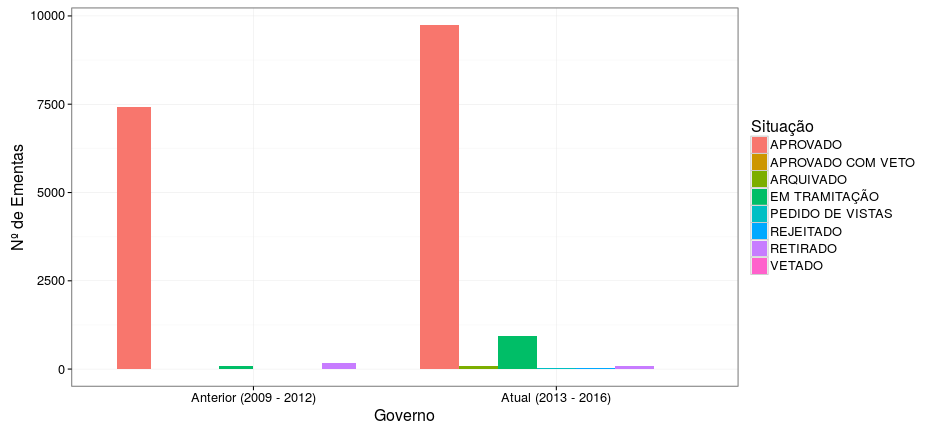
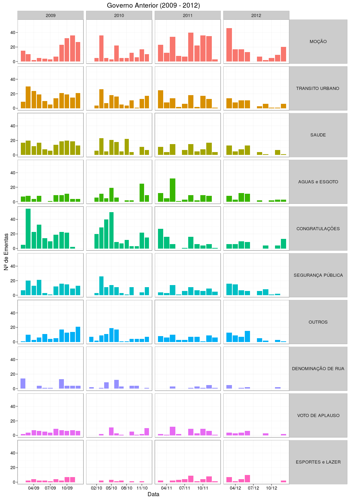
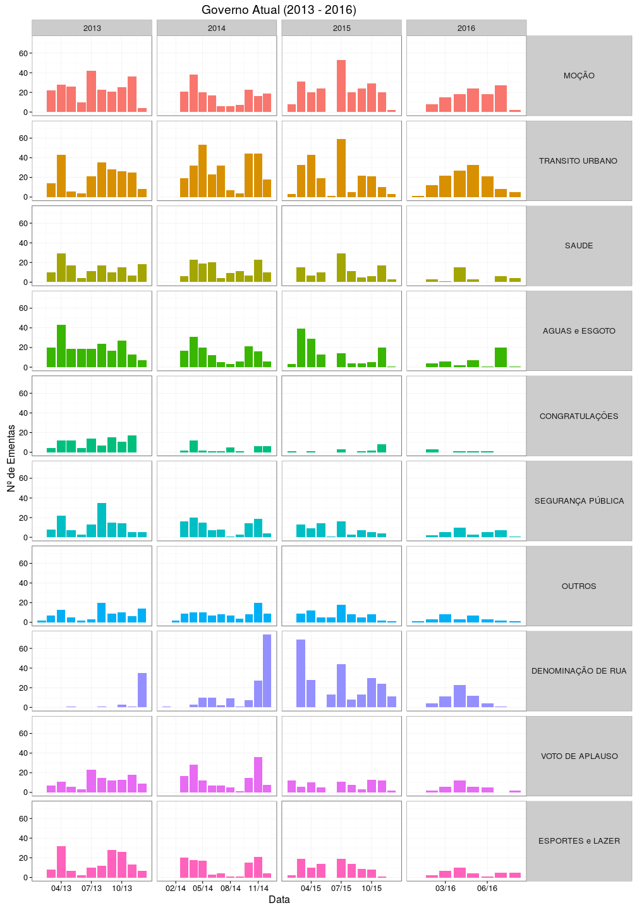

Nessa análise buscamos capturar os padrões temporais das ementas durante os mandatos de cada governo.

Expomos abaixo a quantidade de ementas aprovadas por cada governo durante seus mandatos. Um ponto interessante a ressaltar é o período de férias dos Vereadores. Os vereadores possuem dois períodos de férias anuais:

  * 21 de Dezembro a 19 de Fevereiro (2 meses de férias)
  * 21 de Junho a 19 de Julho (1 mês de férias)

O que acaba impactando negativamente no rendimento das ementas. Os meses de Janeiro e Fevereiro são os que de fato mais sofrem esse impacto, Junho e Julho tendem a ter menos ementas mas isso não é regra geral.


```
## Auto-disconnecting postgres connection (10375, 6)
```



Ao agregarmos a quantidade de ementas por ano capturamos outro padrão interessante. O fôlego dos Vereadores parece diminuir com o passar dos anos de mandato. A quantidade de ementas atinge cerca de 50% no último ano em relação ao 1º ano de mandato.


Os gráficos temporais abaixo comparam a quantidade de ementas para os top-10 temas em cada ano de mandato. Tomamos o cuidade de remover o tema "Serviços Públicos" para evitar a distorção da escala de todos os demais temas devendo o mesmo ser analisado a parte posteriormente. Assim, podemos buscar correlações de acontecimentos que culminaram no acréscimo da quantidade de ementas em determinado tema.


