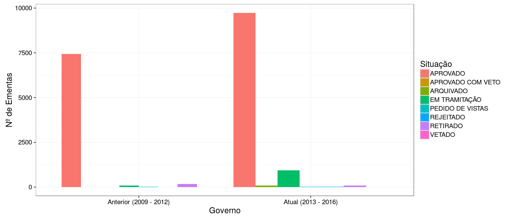
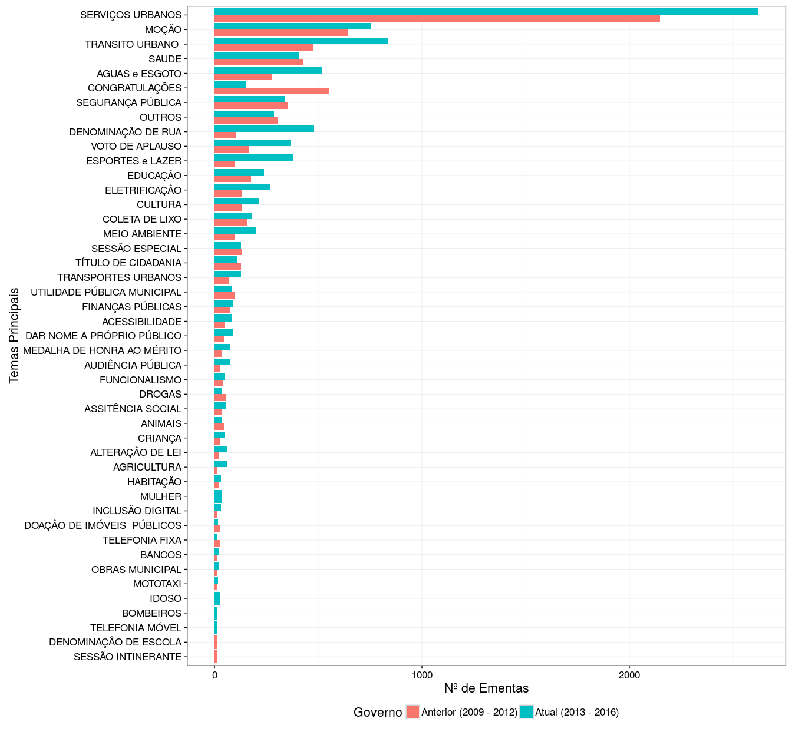
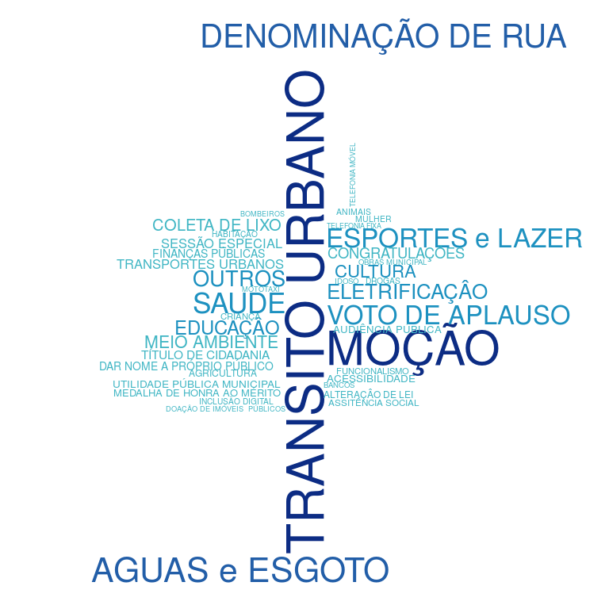

Temáticas Parlamentares
================
19 de Agosto, 2016

Nosso objetivo com essa análise é chamar a atenção para os principais temas que tem sido discutidos na nossa Câmara Municipal. Faremos isso de várias formas, inicialmente mostramos que o governo atual (2013 - 2016) tramitou e aprovou mais ementas do que o governo anterior (2009 - 2012), o que é algo esperado já que o anterior era composto por apenas 16 vereadores e o atual por 23.

Apesar do maior número não podemos tomar conclusões precipitadas. Estamos analisando dados reais, por isso precisamos adentrar mais a fundo, explorar as minúcias para saber quais foram as prioridades de cada governo e averiguar o real valor de cada ementa. Para tal filtramos apenas as ementas aprovadas e mostramos os contadores por tema específico.

Para finalizar expomos a "cara" dos governos com as seguintes nuvems de palavras formadas pelos seus temas mais importantes. Removemos o principal tema para ambos os governos, "Serviços Urbanos", com o objetivo de facilitar a comparação dos demais temas.

**Governo Anterior (2009 - 2012)**

**Governo Atual (2013 - 2016)**

    ## Warning in wordcloud(words = current_govern_theme_count$main_theme, freq =
    ## current_govern_theme_count$n, : SEGURANÇA PÚBLICA could not be fit on page.
    ## It will not be plotted.

Com as nuvens de palavras capturamos mais rapidamente quais os temas mais importantes para cada governo. Concluimos então que depois de "Serviços Urbanos" os 5 temas que mais tiveram ementas aprovadas na Cãmara de Campina Grande do **governo atual** foram:

1.  Trânsito Urbano
2.  Moção
3.  Aguas e Esgoto
4.  Denominação de Rua
5.  Saúde

Enquanto que no **governo anterior** os seguintes temas tiveram maior notoriedade na CMCG:

1.  Moção
2.  Congratulações
3.  Trânsito Urbano
4.  Saúde
5.  Segurança Pública

------------------------------------------------------------------------
