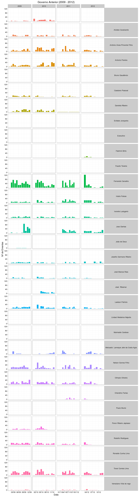

# Meu Vereador? Explique-me por favor...

Nessa análise buscamos capturar os padrões temporais do trabalho dos vereadores da Câmara Municipal de Campina Grande individualmente. E apenas visualizando os gráficos no tempo encontramos alguns vereadores que publicam ementas corriqueiramente, mas estranhamente vemos vários que não tem ementa alguma? Qual a razão dessa disparidade? 

