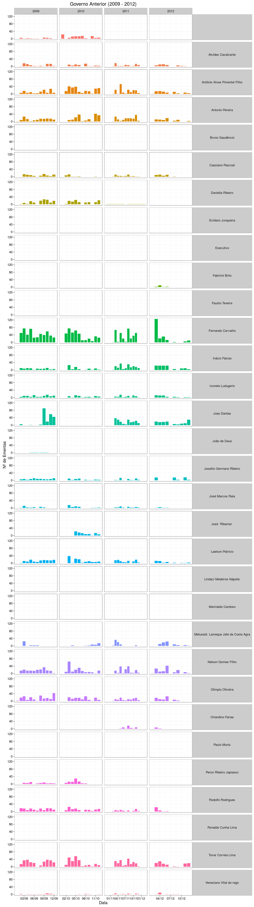
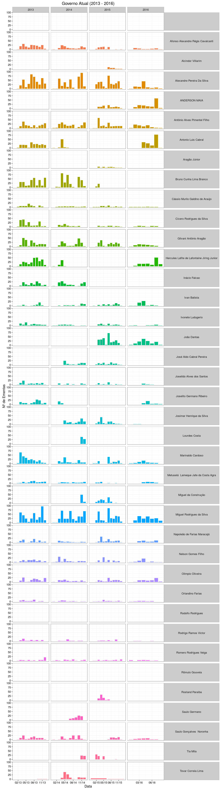

Meu Vereador? Explique-me por favor...
================
19 de Agosto, 2016

Nessa análise buscamos capturar os padrões temporais do trabalho dos vereadores da Câmara Municipal de Campina Grande individualmente (notem que os Prefeitos também estão inclusos pois também podem propor ementas). Visualizando os gráficos no tempo encontramos alguns vereadores que publicam ementas corriqueiramente, mas estranhamente vemos vários que passam meses sem propor ementa alguma? Qual a razão dessa disparidade?

Uma das razões são os mandatos dos Vereadores *suplentes*. Para que um *suplente* exerça a candidatura outro candidato deve sair. Assim, podemos encontrar situações com uma parada repentina na produção de proposições e um início repentino, consequentemente.

------------------------------------------------------------------------
