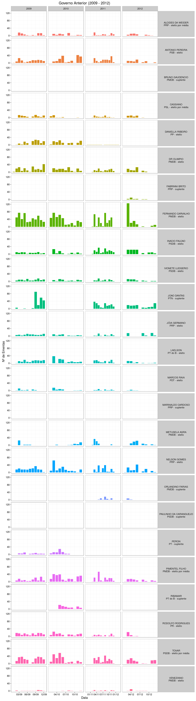
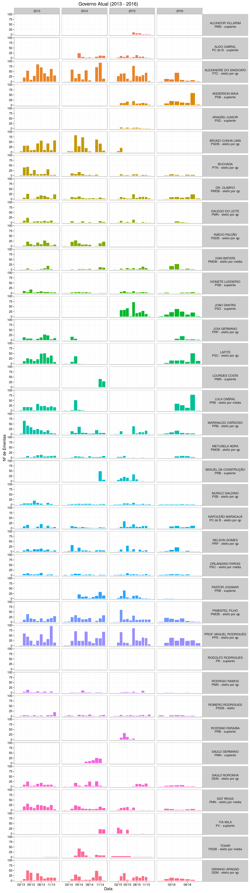

Meu Vereador? Explique-me por favor...
================
19 de Agosto, 2016

Nessa análise buscamos capturar os padrões temporais do trabalho dos vereadores da Câmara Municipal de Campina Grande individualmente (notem que os Prefeitos também estão inclusos pois também podem propor ementas). Visualizando os gráficos no tempo encontramos alguns vereadores que publicam ementas corriqueiramente, mas estranhamente vemos vários que passam meses sem propor ementa alguma? Qual a razão dessa disparidade?

A principal razão está no afastamento dos vereadores do cargo. Vários alegam motivos pessoais e conseguem 121 dias de licença, outros são convocados para cargos executivos, outros são eleitos deputados estaduais e por ai vai. O fato é que esse afastamento causa uma interrupção em seu trabalho. Ao afastar-se um vereador suplente do seu próprio partido o susbstitui, não havendo suplentes o suplente com maior número de votos é convocado. No mandato de 2012 a quantidade de substituições de vereadores foi tamanha, que as nomeações de suplentes ficaram conhecidas como **dança das cadeiras**. Abaixo listamos a maioria das substituições de 2012 extraídas do noticiário online.

Com um pouco de paciência comparando a tabela abaixo com o gráfico acima vemos que a maioria dos vereadores que se afastaram, ao retornarem continuaram com o mesmo fôlego de antes. Ainda mais, vemos vários casos de vereadores suplentes que mesmo depois de devolverem os cargos ainda tem ementas publicadas, demonstrando a dedicação em preparar trabalhos para publicação em futuras sessões.

Que ótima surpresa que os dados nos facultaram! Esse é o valor de ter dados reais nas mãos! Que continuemos assim!

| Afastamento | Vereador Afastado | Partido | Justificativa do Afastamento                                     | Retorno    | Justificativa do Retorno                     | Vereador Suplente    | Partido |
|:------------|:------------------|:--------|:-----------------------------------------------------------------|:-----------|:---------------------------------------------|:---------------------|:--------|
| 01/02/13    | TOVAR             | PSDB    | Chefe de Gabinete do Prefeito                                    | 08/04/14   | Concorrer a Deputado Estadual                | IVONETE LUDGERIO     | PSB     |
| 07/04/2014  | LAFITE            | PSC     | Secretário da Ciência e Tecnologia                               | 04/02/2016 | Entrega do cargo para o ex-vereador Cassiano | ALDO CABRAL          | PC do B |
| 07/04/2014  | LULA CABRAL       | PRB     | Cargo de Secretário Municipal de Cultura                         |            |                                              | PASTOR JOSIMAR       | PRB     |
| 08/04/14    | JOIA GERMANO      | PRP     | Presidência da Urbema                                            |            |                                              | IVONETE LUDGERIO     | PSB     |
| 03/07/2014  | GALEGO DO LEITE   | PMN     | Assuntos pessoais (licença de 121 dias)                          | 02/11/2014 | Fim da licença                               | SAULO GERMANO        | PMN     |
| 01/10/2014  | RODRIGO RAMOS     | PMN     | Assuntos pessoais (licença de 121 dias)                          | 31/01/2015 | Fim da licença                               | LOURDES COSTA        | PMN     |
| 22/10/2014  | BUCHADA           | PTN     | Assuntos pessoais (licença de 121 dias)                          | 21/02/2015 | Fim da licença                               | TIA MILA             | PV      |
| 22/10/2014  | SAULO NORONHA     | DEM     | Presidência da Urbema                                            |            |                                              | MIGUEL DA CONSTRUÇÃO | PRB     |
| 03/02/2015  | TOVAR             | PSDB    | Deputado Estadual                                                | xxx        | xxx                                          | ANDERSON MAIA        | PSB     |
| 03/02/2015  | INÁCIO FALCÃO     | PSDB    | Deputado Estadual                                                | xxx        | xxx                                          | IVONETE LUDGERIO     | PSB     |
| 10/02/2015  | BRUNO CUNHA LIMA  | PSDB    | Deputado Estadual                                                | xxx        | xxx                                          | JOAO DANTAS          | PSD     |
| 10/02/2015  | JOIA GERMANO      | PRP     | Chefe de Gabinete do Prefeito                                    |            |                                              | ARAGÃO JUNIOR        | PSD     |
| 13/03/2015  | MARINALDO CARDOSO | PRB     | Assuntos pessoais (licença de 121 dias)                          | 13/07/2015 | Fim da licença                               | ROSTAND PARAIBA      | PRB     |
| 01/04/2015  | METUSELA AGRA     | PMDB    | Secretario executivo da pasta estadual de desenvolvimento humano |            |                                              | RODOLFO RODRIGUES    | PRB     |
| 17/06/2015  | SGT REGIS         | PMN     | Presidência da AMDE                                              |            |                                              | ALCINDOR VILLARIM    | PMN     |

Obs.: As células em branco indicam datas ou justificativas não encontradas em nossas pesquisas online.

------------------------------------------------------------------------
